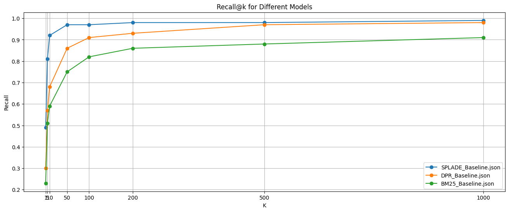

# Information Retrieval Study

이 저장소는 Information Retrieval(정보 검색) 스터디 자료를 담고 있으며, 여러 Sparse, Dense, Generative Retrieval 모델들을 공부하고 실제로 inference(추론) 및 evaluation(평가)하는 과정을 포함하고 있습니다. 실험은 메모리 제한으로 인해 NQ320K 데이터셋을 사용하여 진행되었습니다.

## Used Dataset
### NQ320K 
- [GLEN](https://github.com/skleee/GLEN?tab=readme-ov-file) 링크에서 NQ320K 데이터셋을 사용했습니다.
- `DOC_NQ_first64.tsv`, `GTQ_NQ_dev.tsv`, `GTQ_NQ_train.tsv` 파일을 다운로드하여 `data` 폴더 아래에 위치하세요.
- 메모리 제한으로 인해 문서의 첫 64 token만 포함된 `DOC_NQ_first64.tsv`만 사용하여 검색을 진행했습니다.

## Code Format
기본적으로 다음 과정을 통해 코드가 구성됩니다:
- Sparse/Dense 여부에 따라 폴더가 구분됩니다.
- 각 모델 및 방법론을 하나의 `.ipynb` 파일로 실험합니다. 만약 복잡한 코드가 있을 경우, 추가 폴더를 만들어 사용합니다.
- 예시: `BM25.ipynb` 형식을 기본적으로 사용하며, 필요한 코드들은 `BM25/` 폴더에 저장합니다.
- 최종적으로 `BM25.ipynb` 파일은 각 모델의 예측 결과를 `data/inference/BM25.json` 형태로 저장해야 합니다.
- `Summary.ipynb` 파일은 `data/inference` 내부의 모든 모델 성능을 종합적으로 확인할 수 있는 코드입니다.

## Folder structure
```
.
├── data
│   ├── DOC_NQ_first64.tsv
│   ├── GTQ_NQ_dev.tsv
│   ├── GTQ_NQ_train.tsv
│   └── inference
│       ├── BM25_Baseline.json
│       ├── BM25_Result.json
│       ├── DPR_Baseline.json
│       ├── DPR_Result.json
│       ├── SPLADE_Baseline.json
│       └── SPLADE_Result.json
├── dense
│   └── DPR_Baseline.ipynb
├── figure
│   └── SPLADE_DPR_BM25_figure.png
├── LICENSE
├── README.md
├── sparse
│   ├── splade
│   ├── BM25_Baseline.ipynb
│   └── SPLADE_Baseline.ipynb
└── summary.ipynb
```

## Final Output


## Update Timeline
### 2024.07.16. (Jonghyo)
- Information Retrieval의 기본 모델들 및 baseline 코드를 업데이트했습니다.
  - BM25 (Sparse)
  - SPLADE (Sparse)
  - DPR (Dense)


